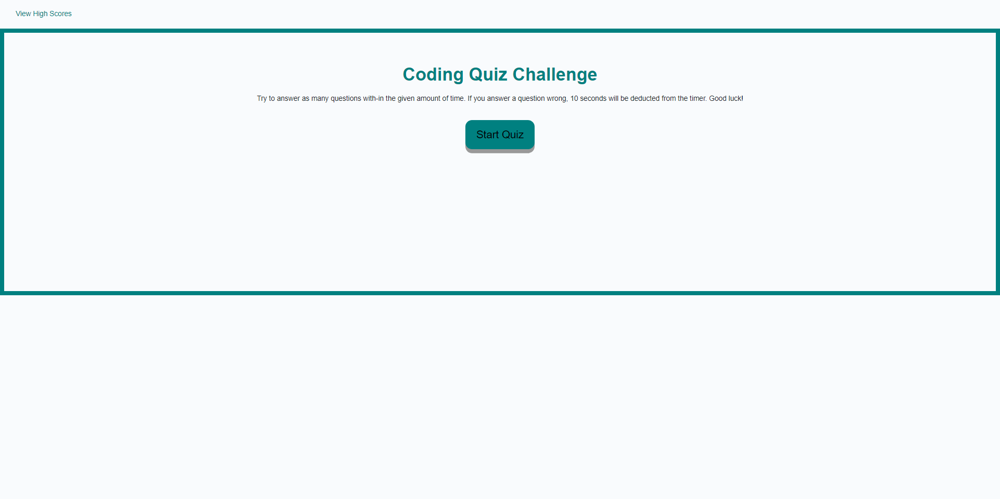

# Code-Quiz
Developed a multiple-choice quiz to test knowledge of javaScript fundamentals. This is a timed quiz that deducts 10 seconds off the clock if a wrong answer is selected. The correct answers will be tallied at the end and the user will have to submit there initials to be placed in a High Scores seciton. The user is then given an option to go back and play again or clear the saved high scores.

# Screen-Shot

# Deployment link
https://t0rgy.github.io/code-quiz/